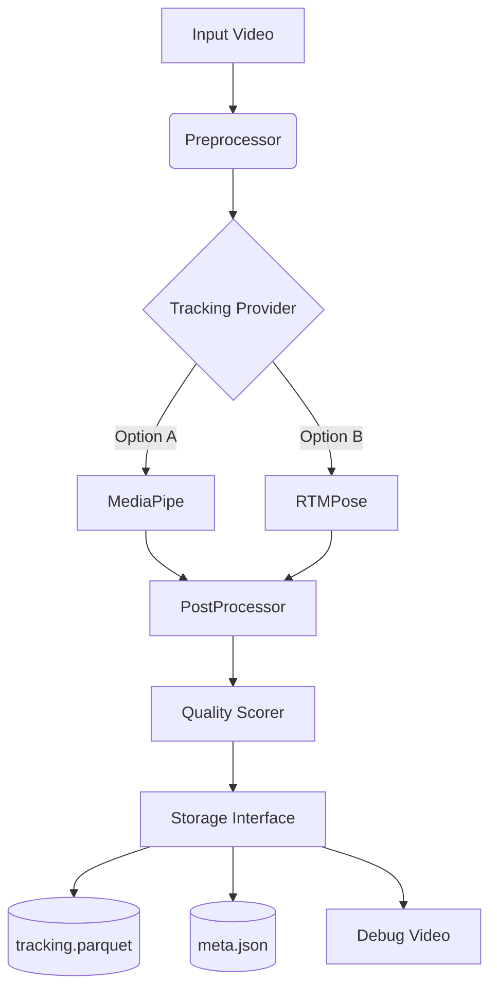

# 🏗️ Architecture

**Version**: 0.2.0 (Phase 2)
**Last Updated**: 2025-12-16

This document describes the high-level design of the NSL Avatar system.

---

## 🔁 Data Flow

The system follows a standard ETL (Extract, Transform, Load) pattern:

1.  **Ingest (Extract)**
    *   **Source**: `.mp4` video files from `video-eksempler/`.
    *   **Tool**: `tracker_app.cli` or GUI.
    *   **Action**: Video is decoded frame-by-frame using OpenCV.

2.  **Process (Transform)**
    *   **Provider**: The frame is sent to a `TrackingProvider` (Abstract Base Class).
        *   `MediaPipeProvider`: Uses Google MediaPipe (CPU/GPU) for fast holistic tracking.
        *   `RTMPoseProvider`: Uses OpenMMLab (GPU) for high-fidelity COCO-WholeBody detection.
    *   **Normalization**: Coordinates are normalized to 0.0-1.0 range.
    *   **Confidence**: Extraction of confidence scores for every point.

3.  **Storage (Load)**
    *   **Parquet**: Efficient binary storage for time-series data (for ML training).
    *   **JSONL**: Human-readable backup (for debugging).
    *   **Metadata**: `meta.json` stores quality metrics.

4.  **Visualize (Output)**
    *   **OpenCV**: Re-draws the skeleton on the original video for verification (`visualization.mp4`).

---

## 🧩 Component Diagram



---

## 📂 Directory Structure

```
NSL-avatar/
├── tracker_app/           # Core Python Package
│   ├── tracking/          # AI Models (The "Brain")
│   ├── store/             # File I/O (Parquet/JSON)
│   ├── analysis/          # Quality Scoring
│   └── cli.py             # Command Line Interface
├── scripts/               # Helper Scripts
│   ├── gui.py             # Gradio Web Interface
│   └── setup_phase2.py    # Environment Installer
├── docs/                  # Documentation
└── workspace/             # Output Data
    └── tracks/            # Unique UUID folders per run
```

---

## 🔌 Key Interfaces

### `TrackingProvider` (Base Class)
Any new AI model must implement this interface:
```python
def track_frame(self, frame, idx, time) -> TrackingResult:
    # Returns standardized landmarks
```

### `TrackingResult` (Data Class)
Standardized format for all providers:
```python
@dataclass
class TrackingResult:
    pose_landmarks: List[Landmark2D]
    left_hand_landmarks: List[Landmark2D]
    right_hand_landmarks: List[Landmark2D]
    face_landmarks: List[Landmark2D]
    # + Confidence scores for all above
```
