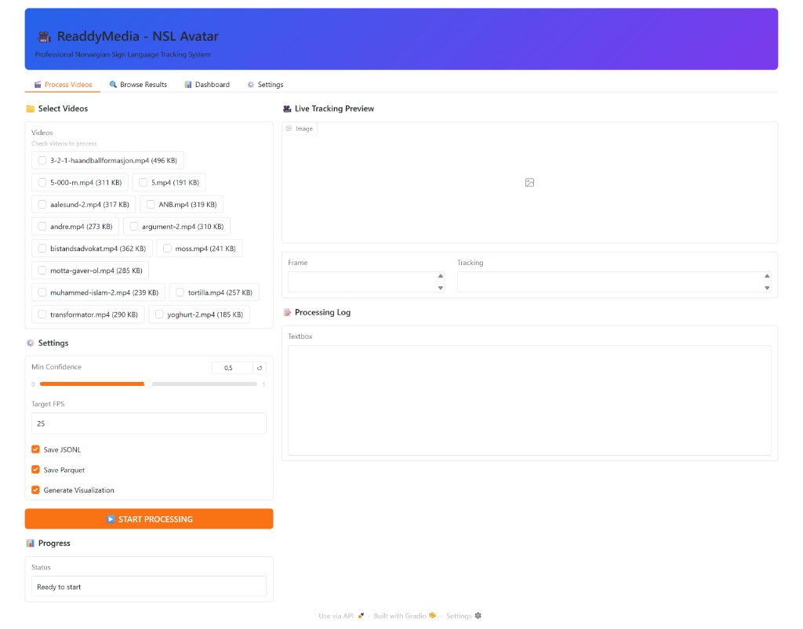
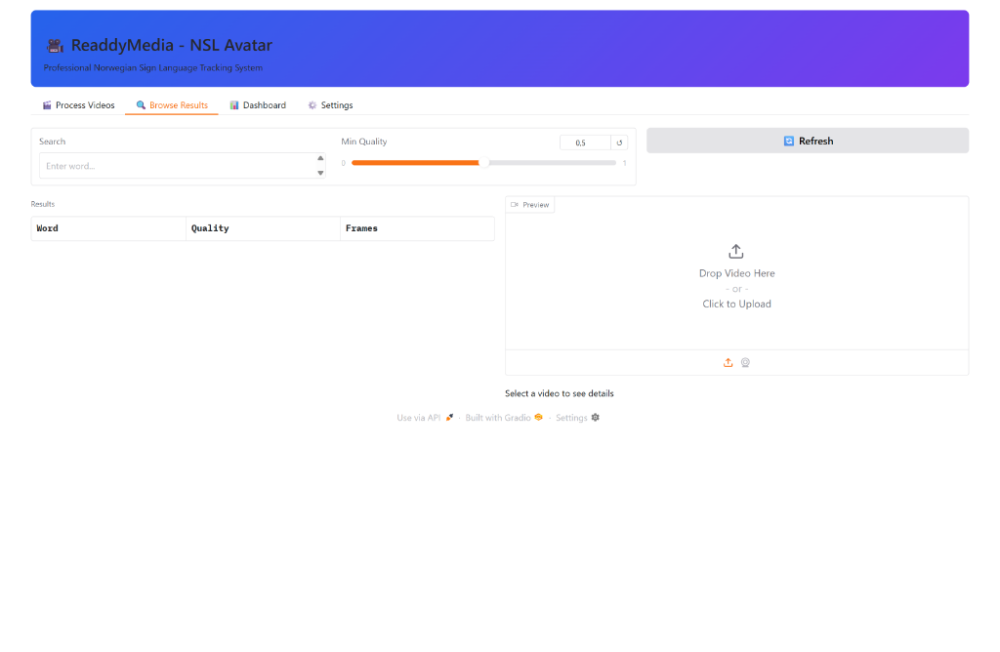
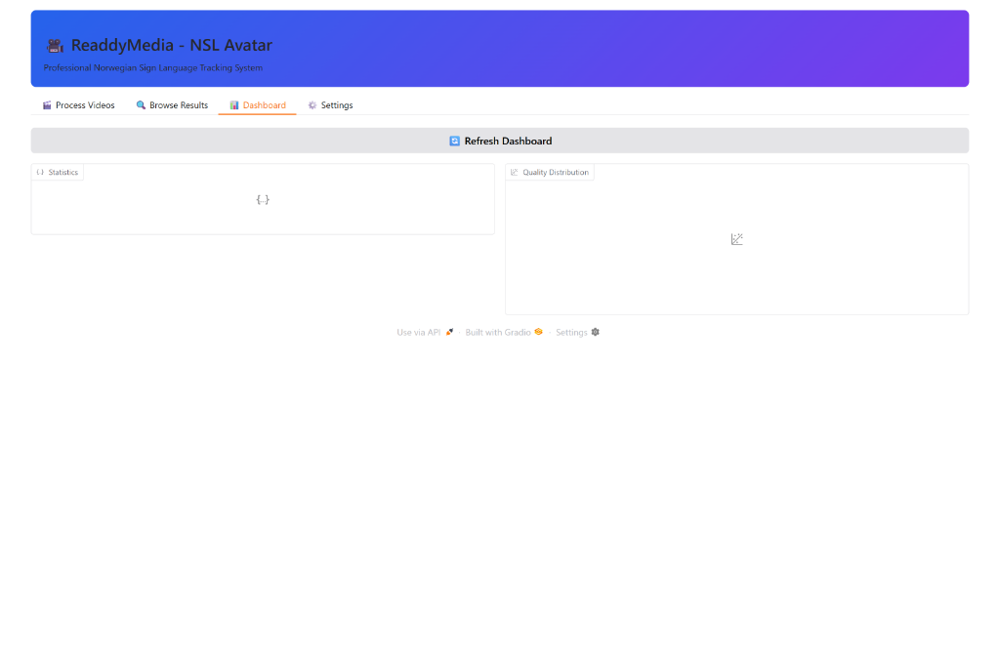
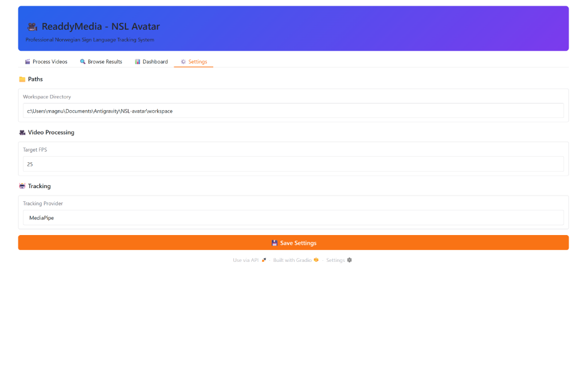

# 🎥 ReaddyMedia NSL Avatar - GUI User Guide

## Overview
**ReaddyMedia - NSL Avatar** is a research-grade interface for processing and analyzing Norwegian Sign Language videos.

### 🚀 Starting the GUI
```bash
python -m scripts.gui
```
Access at: **http://localhost:7860**

---

## 🎬 1. Process Videos Tab
This is where you ingest and process new video files.



### How to use:
1.  **Select Videos**: Check the boxes for the videos you want to process (from `video-eksempler/` folder).
2.  **Configure Settings**:
    *   **Min Confidence**: Threshold for detection (default 0.5).
    *   **Target FPS**: Frame rate for processing (default 25).
    *   **Generate Visualization**: Create mp4s with landmarks overlay (recommended).
3.  **Start Processing**: Click the big blue button.
4.  **Monitor**:
    *   **Log**: Watch the "Processing Log" for status updates.
    *   **Live Preview**: Real-time tracking visualization appears on the right.

### Live Preview Indicators:
*   🟢 **Green Dots**: High confidence (>0.7)
*   🟡 **Yellow Dots**: Medium confidence (0.5-0.7)
*   🔴 **Red Dots**: Low confidence (<0.5)

---

## 🔍 2. Browse Results Tab
View and analyze processed videos.



### Features:
*   **Results Table**: Sortable list of all processed videos.
*   **Search**: Filter by word/filename.
*   **Min Quality Slider**: Hide poor results.
*   **Quality Icons**:
    *   ⭐ > 0.8 (Excellent)
    *   ✓ > 0.7 (Good)
    *   ⚠ < 0.7 (Warning)

---

## 📊 3. Dashboard Tab
High-level statistics about your dataset.



### Features:
*   **Statistics**: Total videos processed, pending, etc.
*   **Quality Distribution**: Histogram showing the spread of tracking quality.
*   **Refresh**: Update stats after new processing.

---

## ⚙️ 4. Settings Tab
Configure system paths and defaults.



*   **Workspace Directory**: Change where results are saved.
*   **Tracking Provider**: Switch between MediaPipe and RTMPose (Phase 2).
*   **Save Settings**: Persist changes.

---

## 💡 Troubleshooting
*   **GUI Won't Start**: Check `requirements.txt` includes `gradio`.
*   **No Videos Listed**: Ensure `.mp4` files are in `video-eksempler/`.
*   **Preview Lag**: This is normal on slower GPUs; the background processing is still accurate.
