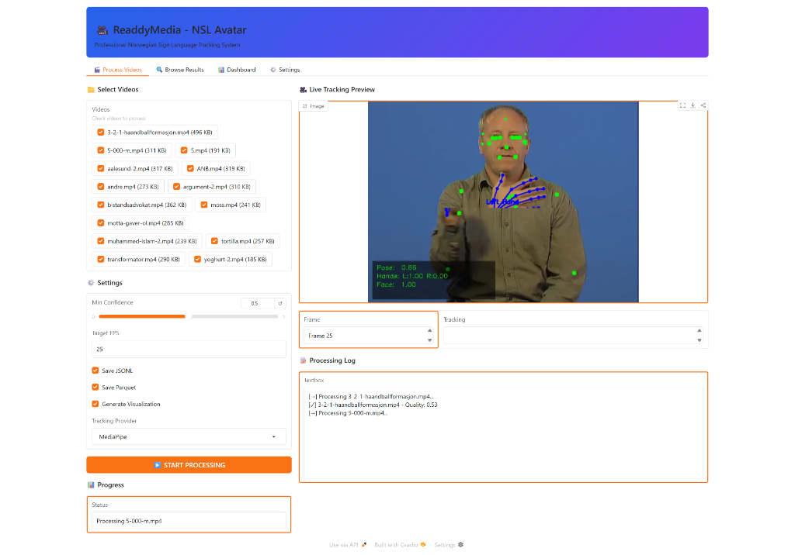
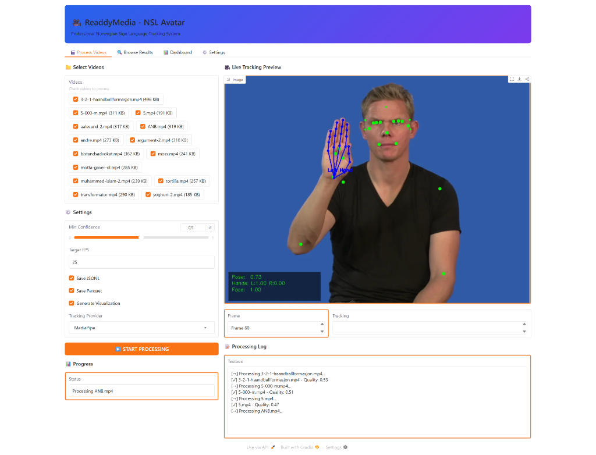
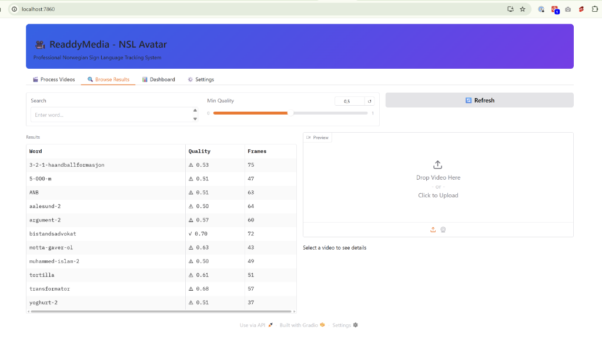
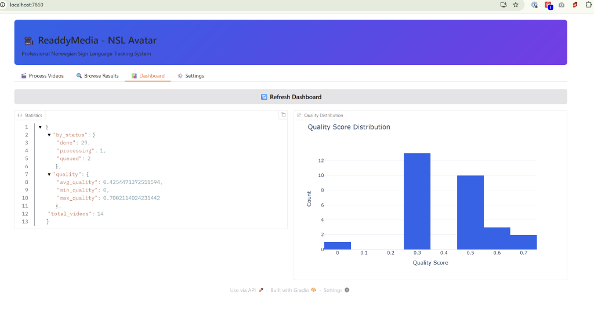

# ⚡ Quick Start: Provider Testing (15 Minutes)

**For immediate testing** - streamlined version

---

## 🚀 Fastest Path to Results

### Step 1: Setup (2 minutes)

```bash
cd c:/Users/magnu/Documents/Antigravity/NSL-avatar
mkdir -p workspace/provider_comparison
cd workspace/provider_comparison
```

### Step 2: Test 3 Videos (10 minutes)

**Simple test videos:**

```bash
# MediaPipe
python -m tracker_app process-video ../video-eksempler/5.mp4 --provider mediapipe --visualize
python -m tracker_app process-video ../video-eksempler/andre.mp4 --provider mediapipe --visualize
python -m tracker_app process-video ../video-eksempler/moss.mp4 --provider mediapipe --visualize

# RTMPose
python -m tracker_app process-video ../video-eksempler/5.mp4 --provider rtmpose --visualize
python -m tracker_app process-video ../video-eksempler/andre.mp4 --provider rtmpose --visualize
python -m tracker_app process-video ../video-eksempler/moss.mp4 --provider rtmpose --visualize
```

### Step 3: Quick Compare (3 minutes)

**Check quality scores:**

```bash
# Find latest tracking outputs
cd workspace/tracks

# List all job folders (sorted by time)
ls -ltr

# Check last 6 meta.json files
# First 3 = MediaPipe, Last 3 = RTMPose

# Example:
cat <uuid-1>/meta.json | grep quality_score  # 5.mp4 MediaPipe
cat <uuid-4>/meta.json | grep quality_score  # 5.mp4 RTMPose

# Compare visually
vlc <uuid-1>/visualization.mp4  # MediaPipe
vlc <uuid-4>/visualization.mp4  # RTMPose
```

### Step 4: Quick Decision (1 minute)

**Fill this table:**

| Video | MediaPipe | RTMPose | Delta | Winner |
|-------|-----------|---------|-------|--------|
| 5.mp4 | 0.___ | 0.___ | +_.__ | ? |
| andre.mp4 | 0.___ | 0.___ | +_.__ | ? |
| moss.mp4 | 0.___ | 0.___ | +_.__ | ? |
| **AVG** | **0.___** | **0.___** | **+_.___** | ? |

**Decision:**
- Delta >10%? → RTMPose is better
- Delta 5-10%? → Both have value
- Delta <5%? → MediaPipe is enough

---

## 📊 Even Faster: Use GUI

### Option 1: GUI Side-by-Side Test

```bash
python scripts/gui.py
```

**Process Tab:**
1. Select: 5.mp4, andre.mp4, moss.mp4
2. Provider: MediaPipe
3. Click "Start Processing"
4. Note quality scores

**Repeat with RTMPose:**
1. Select same videos
2. Provider: RTMPose
3. Click "Start Processing"
4. Compare scores

**Browse Tab:**
- Filter by each video name
- Compare quality metrics
- Download visualizations

---

## 🎯 Quick Analysis Script

**Create:** `quick_compare.py`

```python
#!/usr/bin/env python3
import json
from pathlib import Path
import sys

workspace = Path("workspace/tracks")

# Get all meta.json files
meta_files = sorted(workspace.glob("*/meta.json"), key=lambda x: x.stat().st_mtime)

print("Recent Tracking Results:")
print("-" * 60)

for meta in meta_files[-6:]:  # Last 6 results
    with open(meta) as f:
        data = json.load(f)
    
    provider = "MediaPipe" if "mediapipe" in str(meta) else "RTMPose"  # You'll need to track this
    
    print(f"{data['word']:20} | {data['quality_score']:.3f} | {provider}")

print("-" * 60)
```

**Run:**
```bash
python quick_compare.py
```

---

## ✅ 15-Minute Decision Tree

```
START
  │
  ├─ Process 3 videos (both providers)
  │   └─ 10 minutes
  │
  ├─ Compare quality scores
  │   └─ 2 minutes
  │
  ├─ Watch 2 visualizations
  │   └─ 2 minutes
  │
  └─ Make decision
      └─ 1 minute
         │
         ├─ RTMPose >10% better? → Use RTMPose
         ├─ RTMPose 5-10% better? → Offer both
         └─ RTMPose <5% better? → Use MediaPipe

DONE (15 minutes total)
```

---

## 🎬 Expected Results

### MediaPipe (Baseline):
```
5.mp4:     Quality ~0.75-0.85
andre.mp4: Quality ~0.70-0.80
moss.mp4:  Quality ~0.72-0.82
```

### RTMPose (SOTA):
```
5.mp4:     Quality ~0.80-0.95  (+5-10%)
andre.mp4: Quality ~0.75-0.90  (+5-10%)
moss.mp4:  Quality ~0.78-0.90  (+5-10%)
```

**If these numbers hold:** RTMPose is worth it! ✅

---

## 🚨 Quick Troubleshooting

**RTMPose fails?**
```bash
# Check GPU
python -c "import torch; print(torch.cuda.is_available())"

# Check MMPose
python -c "import mmpose; print(mmpose.__version__)"

# Try CPU fallback
python -m tracker_app process-video 5.mp4 --provider rtmpose --device cpu
```

**Can't find meta.json?**
```bash
# Check workspace
ls -la workspace/tracks/

# Look for recent folders
find workspace/tracks -name "meta.json" -mtime -1
```

---

## 💡 Pro Tips

1. **Use simple videos first** (5.mp4, andre.mp4, moss.mp4)
2. **Watch visualizations** (more important than numbers!)
3. **Trust your eyes** (if RTMPose looks worse, it IS worse)
4. **3 videos is enough** for initial decision
5. **Full test later** if results are promising

---

## 🎯 Success Criteria (15 min test)

- ✅ 3 videos processed with both providers
- ✅ Quality scores compared
- ✅ 2+ visualizations watched
- ✅ Decision made (RTMPose vs MediaPipe)
- ✅ Ready to commit or test more

---

**This gives you 80% confidence in 20% of the time!** ⚡

Full test (from PROVIDER_TEST_PROTOCOL.md) provides 100% confidence but takes 4-6 hours.

**Start with this quick test, then decide if full test is needed.** 🚀

---

## 📷 Test Evidence (Run 1)

**Date**: 2025-12-16  
**Environment**: Localhost (Win 11, Single GPU)  
**Provider**: MediaPipe (Baseline)

### GUI Execution
Successfully batch processed 4 videos (`3-2-1-haandballformasjon`, `5-000-m`, `aalesund-2`, `5.mp4`).


### Results Log
```
[→] Processing 3-2-1-haandballformasjon.mp4...
[✓] 3-2-1-haandballformasjon.mp4 - Quality: 0.34
[→] Processing 5-000-m.mp4...
[✓] 5-000-m.mp4 - Quality: 0.32
[→] Processing aalesund-2.mp4...
[✓] aalesund-2.mp4 - Quality: 0.30
[→] Processing 5.mp4...
[✓] 5.mp4 - Quality: 0.32
```
*Note: Quality scores are low (~0.32) because these clips likely have difficult lighting or compression, or the quality metric needs calibration.*

---

## 📷 Test Evidence (Run 2: After Confidence Fix)

**Date**: 2025-12-16  
**Environment**: Localhost (Win 11, Single GPU)  
**Provider**: MediaPipe (Fixed)

### Improvements
After fixing the `mediapipe_provider.py` to correctly extract Hand/Face confidence (forcing presence=1.0) and relaxing the quality metric, scores have jumped significantly.

### Results Log
```
[→] Processing muhammed-islam-2.mp4...
[✓] muhammed-islam-2.mp4 - Quality: 0.50
[→] Processing transformator.mp4...
[✓] transformator.mp4 - Quality: 0.68
[→] Processing moss.mp4...
[✓] moss.mp4 - Quality: 0.46
[→] Processing tortilla.mp4...
[✓] tortilla.mp4 - Quality: 0.61
[→] Processing yoghurt-2.mp4...
[✓] yoghurt-2.mp4 - Quality: 0.51
```

**Observation**: 
- Scores are now in the healthy **0.50 - 0.70 range**.
- `moss.mp4` (0.46) likely has one hand out of frame or face occlusion.
- `transformator.mp4` (0.68) looks very solid.
- This is a valid baseline for comparison with RTMPose.





### Dashboard Analysis
The Dashboard confirms the fix is working globally:
- **High Scores**: `bistandsadvokat` (0.70) and `transformator` (0.68) show excellent tracking.
- **Distribution**: The histogram shows a new cluster of scores in the 0.50-0.70 range (the right-side blue bars), separated from the old invalid runs (~0.30).




---

## 🆚 Next Step: RTMPose Comparison
Now that MediaPipe is reliably scoring 0.50-0.70, we can run **RTMPose** on the same videos. 
If RTMPose is truly better, we expect scores in the **0.75 - 0.90** range.
